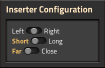
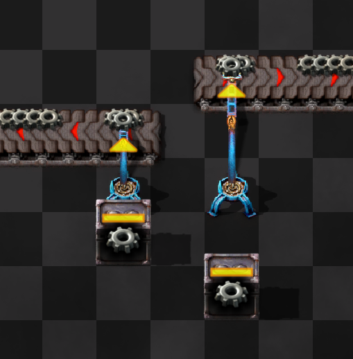
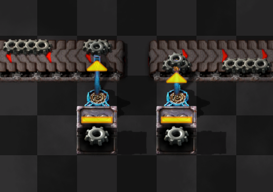
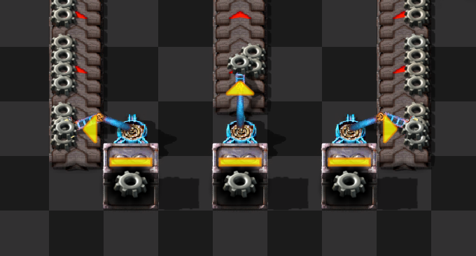

# Simple Configurable Inserters
A Factorio mod that adds simple configuration options to inserters.
Allows 90° dropoff, extending arm length and choosing dropoff lane.
A standalone part of the Delta [Δ] Overhaul.

## Why?
I didn't like how other mods allowed 45° or other angles, extending arms more than base game long inserters reach of 2 tiles, and other abstract inserter settings.

# What does it do?
Inserters can be configured via their GUI or using keybinds while hovering on them.
They also work with built in mirror functions.

## Inserter's arm length
Default keybind: [L]
Long-Handed Inserters become obsolote with their functionality built into other inserters. Just like Filter Insterters in 2.0! 
By default their recipe will become hidden, leaving only the other inserters. [It can be changed in the Startup Settings]

## Dropoff target lane
Default keybind: [Shift + L]
Works exactly like Krastorio 2's Drop Lane function.
It allows inserters to place items on belt's closer lane.

## Turning inserter angles
Default keybind: [Ctrl + R]
Allows inserters to place items on their left or right. Removing the limitation of only forward movement of items. 
Allows for more compact builds. Spaghetti and meatballs, anyone?

## Blacklist
Inserters can be blacklisted from using either the Length or Direction configuration using Map Settings. 